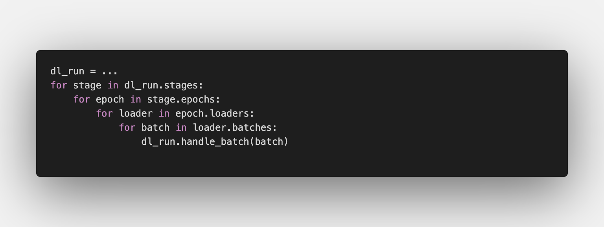
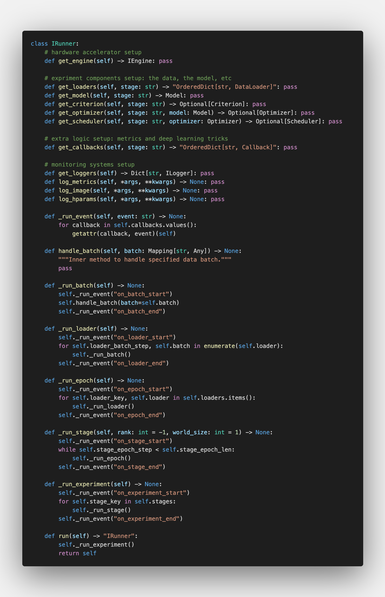
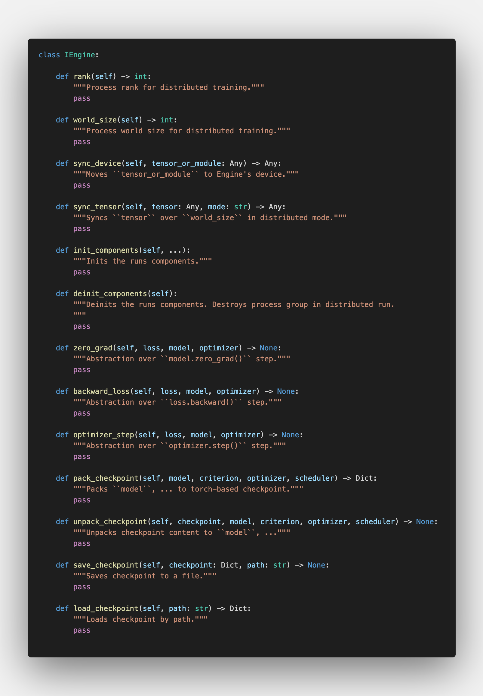
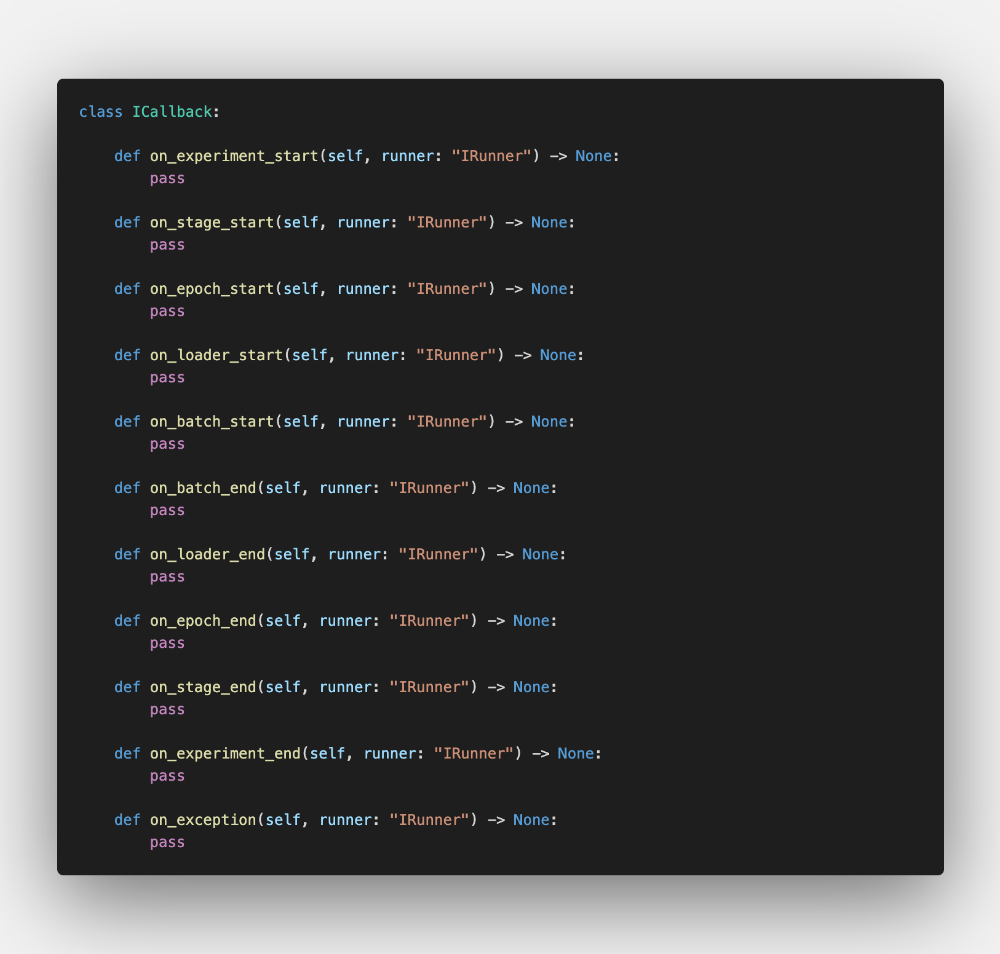
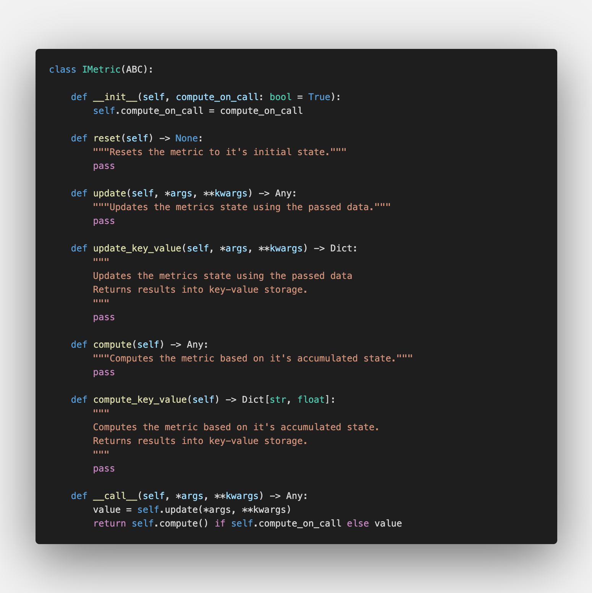
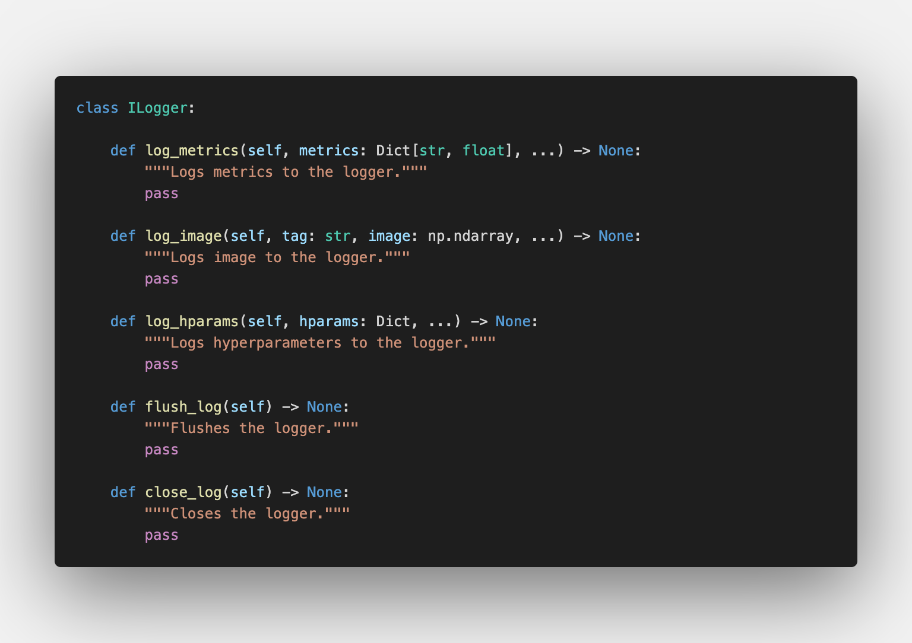

```Shell
== date: 2020-09-17
== description: How to use notion as a content manager to generate a static blog.
```

**譯者按**

我平時在訓練神經網絡的時候，幾乎每次都要重新寫很多內容。倒也不是不能在之前的腳本上面改，主要是覺得改起來不如寫起來方便，況且不同的實驗也或多或少有不一樣的地方；就算改，每次或多或少都會遇到些問題，例如在某個不知名的角落裏寫死了一個變量。
一直都有個想寫個兼容各種實驗的代碼庫的想法，但是後來發現工作量不小，遂作罷。最近在網絡上發現了Catalyst這個庫，簡單看了下內容，發現與我之前的代碼庫思路比較一致，很多地方幫助我們造好了不錯的輪子。現在把前一段時間這個項目作者Lead寫在medium上面的一篇博客翻譯給大家，希望能幫助到有需要的人。


  
<!--TOC-->

  
[Catalyst - A PyTorch Framework for Accelerated Deep Learning R&D](https://medium.com/pytorch/catalyst-a-pytorch-framework-for-accelerated-deep-learning-r-d-ad9621e4ca88)

> 作者：Sergey Kolesnikov 
>
> 譯者：Elijah Ma
>
> 原文：[medium.com](https://medium.com/pytorch/catalyst-a-pytorch-framework-for-accelerated-deep-learning-r-d-ad9621e4ca88)

在過去的十幾年當中，隨着深度學習的發展，各式各樣相關的開源項目和框架也逐漸被人所熟知。例如PyTorch就可以說是當中最被研究人員青睞的項目之一。得益於符合Python哲學的設計與良好的底層實現，許多研究團隊都選用Pytorch作爲工具。但是，能力愈強，責任愈大，由於涉及很多與底層密切相關的函數，PyTorch的用戶們常常在研究過程中會遇到不少Bug。另外，隨着硬件加速訓練的崛起，一個能夠在不同硬件平臺上適配的簡單API成爲了當下一個迫切的需要。

最近三年，Catalyst-Team一直在研發Catalyst。這是一個基於PyTorch的深度學習研發框架。這個框架致力於改善實驗的可復現性、開發速度以及代碼重用率，因此，用戶們在設計新的實驗時可以把造輪子的時間用來實現一些新的想法。在Catalyst當中，你可以輕易的實現不同的度量函數、模型存檔、多種多樣的日誌方式以及分佈式訓練，並且可以極大避免翻來覆去都差不多的代碼和根本不知所云的底層Bug。

在這篇文章當中，我將分享一些我們對於這種高級深度學習框架API的思考，並且利用各種各樣的例子來展示這個項目當前的开发进展。

---
# Deep Learning recap 深度學習覆盤

在我們開始之前，我們先來看看在我們用隨機梯度下降法訓練深度學習模型的時候，都在做些什麼：



當我們開始一個實驗的時候，可能先定義了一些訓練階段、Epoch數以及數據集的處理。在這之後，我們一遍又一遍的把數據採樣成Batch，然後推理，根據誤差函數算出距離，再利用梯度下降進行參數更新。沒錯，就是這麼簡單。但是，隨着項目的發展和更多Tricks的加入，例如加入了更多不同的誤差函數和更新策略，或者我們要在新的硬件加速平臺上進行訓練，代碼和邏輯可能就不如上面這樣直觀了。

---
# Catalyst 

爲了解決上面遇到的這類問題，我們創造了Catalyst，一個致力於改善實驗的可復現性、開發速度以及代碼復用的PyTorch深度學習研發框架。這個框架提供了一些在實驗過程當中實用的抽象概念：

* `Runner` 運行抽象
* `Engine` 推理引擎抽象
* `Callback` 回調函數抽象
* `Metric` 度量抽象
* `Logger` 日誌抽象

## `Runner` 運行抽象

第一個要介紹的抽象就是`Runner` ，在這個抽象當中，包含了一切你所需要的實驗邏輯：數據集、模型、每個Batch的預處理以及後處理、誤差函數甚至包括監控系統的指定。



`Runner`是最重要的一個抽象，因爲它鏈接了所有其他的接口，並且畢竟整個實驗的邏輯都寫在這裏面了。最重要的是，這個抽象並不強迫你按照Catalyst庫中預設的實驗邏輯來部署。它提供了一個靈活的方式來決定你要從這個框架的high-level API當中自定義到哪個程度。

我們提供了幾個例子，供大家參考：

* 利用`Runner`和`Callback`定義一切：[ML - 多分類任務](https://github.com/catalyst-team/catalyst#minimal-examples)
* 利用Catalyst的循環裝飾器自定義推理與反向傳播：[自定義](https://github.com/catalyst-team/catalyst#minimal-examples)[`Runner`](https://github.com/catalyst-team/catalyst#minimal-examples) [- PyTorch for循環解構](https://github.com/catalyst-team/catalyst#minimal-examples)
* 對不同方法的融合：[CV - MNIST GAN](https://github.com/catalyst-team/catalyst#minimal-examples) / [CV - MNIST VAE](https://github.com/catalyst-team/catalyst#minimal-examples)

另外指的一提的是，Runner的結構並不依賴於PyTorch，我們也提供了如何兼容Tensorflow2和JAX的一些思路。

支持的`Runner`都列在文檔中Runner API一章的下面了。

## `Engine` 推理引擎抽象

`Engine` 推理抽象是 Runner 的主要組成部分。這個部分定義了硬件之間的通訊邏輯。例如分佈式訓練和混合精度訓練之類的訓練方法也是在這裏進行定義的。



得益於Engine的這個抽象，我們可以直接將模型訓練的Pipeline在不同的硬件平臺上進行部署。比如說PyTorch的DDP分佈式、Apex混合精度、AMP混合精度等訓練方法。也可以在例如DeepSpeed、Horovod以及TPU等平臺上進行訓練。

可以在文檔中Engine API章節下面看到各`Engine`的開發進展。

---
## `Callback` 回調函數抽象

Callback 是一個定義Pipeline邏輯的地方。上面提到過，我們可以利用Catalyst作爲一個For循環的裝飾器來實現任何原生的PyTorch功能。但有了Callback之後，我們在利用例如數據增強、複雜損失函數計算等方法的時候就更加容易了。在下面的例子當中，定義所需要的誤差度量函數就變得非常簡便：

* [ML - 多分類任務](/61941d3c0be04cc29e9cfa0d784d8a29)
* [ML – 推薦系統](https://github.com/catalyst-team/catalyst#minimal-examples)

Callback API在train循環當中不斷運行如下這些小的函數：



你可以在文檔當中Callback API章節下面找到所有支持的回調函數。

---
## `Metric` 度量抽象

除了對訓練邏輯和方法等可復用內容的抽象，Catalyst也提供了在實驗中可以幫助誤差計算的`Metric`抽象。它的API非常簡單：



你可以在文檔中Metric API章節下面找到所有支持的`Metric`方法。

Catalyst的Metric API中所有的誤差函數都支持更新和計算key-value形式的誤差結果。這種形式在訓練過程中會讓各種Loss的含義表達非常明確，並且也提供了一種可以存儲你想在日誌當中記錄任意數量Loss或者狀態值的規則。

---
## `Logger` 日誌抽象

最後，日誌系統。在Catalyst 21版本的Release當中，我們把各種監控系統的API整合到了一個類當中。



在這樣一個簡單的API下，我們已經提供了對MLFlow以及Tensorboard的整合。例如Neptune和WandB這種高級的Logger，我們團隊也正在開發當中。

所有當下支持的`Logger`可以在文檔當中Logger API章節下找到。


