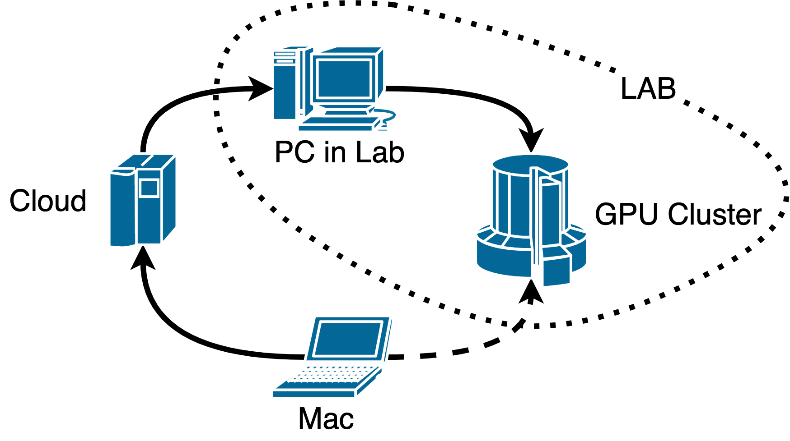

# 

假設我們有如下這些設備，我用<user>@<ip>來表示對應用戶名和其主要網卡的IP：

1. GPU算力集羣，叫`gpu_cluster`：`<gpu_cluster>@<gpu_server_ip>` 
（位置：實驗室的局域網內，不可鏈接互聯網）
2. 實驗室PC，叫`<lab_pc>`: `<lab_pc>@<lab_pc_ip>`
（位置：實驗室的局域網內，可以鏈接互聯網）
3. 終端機，叫`mac`：`<my_mac>@<mac_ip>` _（是你要執行登錄用的機器）_
（位置：你公司/家裏/咖啡館的某個網絡之中，可能沒有公網IP，不過無所謂啦。）
4. 互聯網雲服務器，叫`cloud_server`：`<cloud_server>@<cloud_server_ip>`
（位置：互聯網中，不可直接誒訪問實驗室局域網，**❗️️有一個公網獨立IP**）
5. 實驗室PC，叫`lab_pc`：`<lab_pc>@<lab_pc_ip>`  _（也就是SSH跳板機）_
（位置：實驗室局域網內，可鏈接互聯網）

那這個時候，**我突然想用我的終端機在咖啡館訪問到實驗室的GPU算力集羣**。由於GPU算力集羣不能鏈接公網，所以我們可能直覺上就會說，通過我在實驗室的工作機來訪問GPU算力集羣。但是你在咖啡館也`ping`不到你在實驗室的PC機。這時有公網獨立IP的一個服務器就非常重要，因爲你的便攜機Mac和實驗室的PC在公網都沒有屬於自己的IP，但他們都有鏈接上互聯網。如果有一個他們都能直接訪問到的IP，就可以通過這個中轉站進行通訊。



可是，如何實現呢？

# 透過安全外殼協議SSH的端口轉發

SSH是通常我們用來登錄位於網絡當中的某個機器的外殼所用的協議。最常用的方法大概是這樣：

```Shell
ssh -p <port> <user>@<ip>  # port is 22 by default
```

這就是最簡單的正向鏈接，參數`-p`告訴工具要透過某個端口鏈接，默認是`22`號端口。那麼除了-p參數，我再列舉幾個手冊中的參數說明在這裏。

1. `-R` ：將遠端指定的端口**轉發至本機**的某一個端口
  *Specifies that connections to the given TCP port or Unix socket on the remote (server) host are* __*to be forwarded to*__ *the* **_local_** _side._

2. `-L`：將本地指定的端口**轉發至遠端**的某一個端口
  *Specifies that connections to the given TCP port or Unix socket on the local (client) host are* **_to be forwarded to_** *the given host and port, or Unix socket, on the* **_remote_** _side._

3. `-f`：後臺形式保持鏈接
_Run SSH as daemon progress_

看到`-R`和`-L`兩個參數，貌似与我们的需求有点关系。他們比較常用的用法大概是這樣

```Shell
# -R
$ ssh -R -N $TO_REMOTE_PORT:localhost:$FROM_LOCAL_PORT $REMOTE_USER@$REMOTE_HOST
# -L
$ ssh -L -N *:$TO_LOCAL_PORT:localhost:$FROM_LOCAL_PORT localhost
```

在本文當中，我們通過`-L`來進行本地和本地端口轉發，通過`-R`來進行機器之間的端口轉發。而另外的参数`-N`则是告訴SSH不要登錄Shell，不執行指令，僅作端口轉發。

## 僅內網機器和跳板機之間的鏈接

最重要的就是內網機器（內網當中可以訪問網絡的機器）和跳板機（實驗室內可以訪問公網的機器）之間的鏈接，因爲這個鏈接解決了內網和公網之間的隔閡。如果說沒時間完善更多的鏈接，甚至都可以直接建立好這個鏈接之後透過公網服務器登錄到內網機器，再通過內網IP來尋找到你的目標服務器（GPU算力集羣），雖然麻煩了些，但是起碼已經可以連通了。

本例當中，我們首先要在內網的機器上進行操作。在內網可以鏈接互聯網的機器`<lab_pc>`上面將自己的`22`端口轉發到服務器上的某個端口 `<port_on_server>` ，然後就可以在服務器上通過這個端口進行訪問了。

具體鏈接指令寫在這裏，注意：`<lab_pc> $` 表示你是在 `<lab_pc>`上執行的操作。

```Shell
**<lab_pc> 
$** autossh -M <monitor_port> -R -N <port_on_server>:localhost:22 <cloud_server>@<cloud_server_ip>
```

這裏使用了`autossh`，實際上他和`ssh`最大的區別就是多了個監視端口參數`-M <monitor_port>`，利用這個監視端口，我們可以監控鏈接有沒有意外發生broken pipeline。斷線則自動重連，在遠端長時間轉發當中十分實用。

現在就可以透過以下指令鏈接內網機器了，然後進入內網之後，你想鏈接算力集羣或者其他機器就都不成問題了。注意這裏的用戶名應該是我們最終到達機器的用戶名。

```Shell
**<my_mac>
$** ssh -p <port_on_server> <lab_pc>@<cloud_server_ip>
```

## 算力集羣與跳板機之間的鏈接

由於本例當中算力集羣並不能訪問互聯網，所以我們要把算力集羣先鏈接至可以訪問公網的內網機器，然後在通過上面講述的方法鏈接到公網服務器上。大多數情況下，局域網內網絡應該都還不錯，不太會出現斷線，所以也可以不使用`autossh`來進行監控鏈接狀況，直接`ssh`鏈接即可。這時登錄要鏈接的GPU算力集羣，我們將他的`22`端口轉發到實驗室PC上來。

```Shell
**<gpu_cluster>
$** ssh -R -N <port_on_lab_pc>:localhost:22 <lab_pc>@<lab_pc_ip>
```

由於接下來我們需要把`<lab_pc>`上面`<port_on_lab_pc>`的鏈接轉發出去，但這裏要注意一個問題，如果繼續轉發`<port_on_lab_pc>`到公網服務器的話，在我的實踐當中會出莫名失敗，所以這裏更推薦的方法是再加一層本機上的端口轉發（或許是起到了detach之用），這就要用到之前提到的-L參數了。

```Shell
**<lab_pc>
$** ssh -L -N *:<reassign_port>:localhost:<port_on_lab_pc> localhost
```

這時我們再利用上一節當中所用的`autossh -R`將這個本地轉發過端口繼續轉發到公網服務器上面去。

```Shell
**<lab_pc> 
$** autossh -M <monitor_port> -R -N <port_on_server>:localhost:<reassign_port> <cloud_server>@<cloud_server_ip>
```

這時我們就可以依舊直接`ssh`服務器上的對應端口，就可以直接連線到GPU算力集羣上面了

```Shell
**<my_mac>
$** ssh -p <port_on_server> <lab_pc>@<cloud_server_ip>
```

恭喜您。

